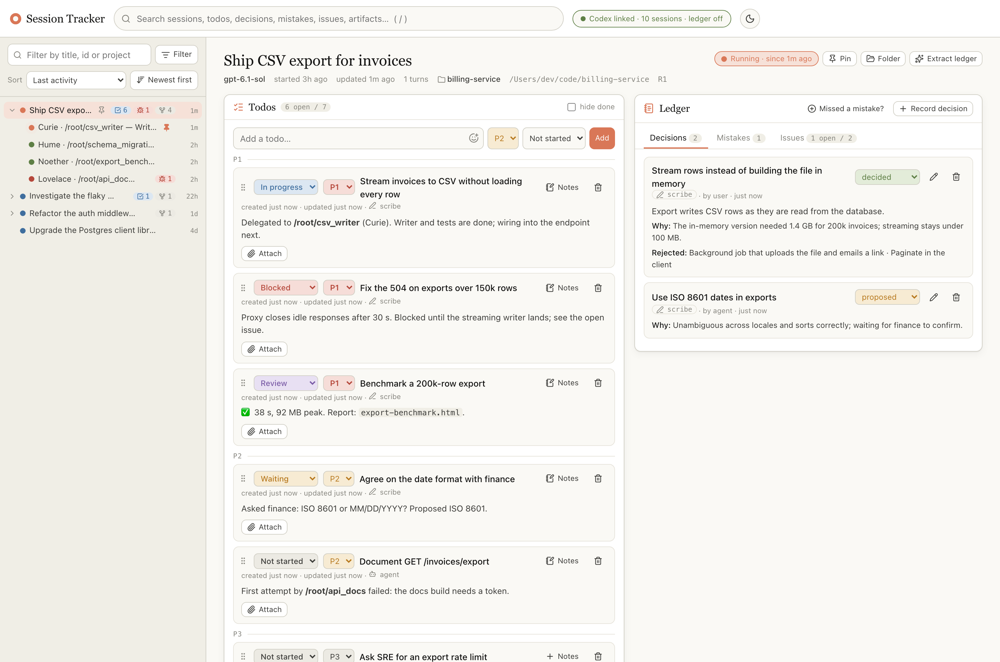
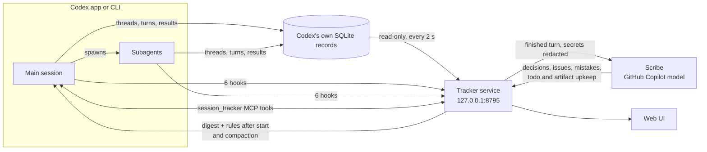

# Session Tracker

Durable state for Codex sessions that run other sessions. Every session and subagent gets its own **todos**, **artifacts**, **child sessions** and a **ledger** of decisions, issues and mistakes. The state survives compaction, restarts and crashes. You read it in a local web UI; the sessions read and update it over MCP.



<sub>Demo data from `tools/demo.py`; nothing in the screenshot is real.</sub>

## Why

A productive way to work with Codex is to keep one main session free for conversation, planning and review, and hand focused work to subagents, which may spawn their own. After a few hours and a few compactions, simple questions get hard: Which tasks are still running? What did that subagent produce? Did we already try this? What did we decide about X, and why?

Session Tracker keeps the answers in a local database that the model doesn't have to remember to update. Most of it is derived from Codex's own records. A separate "scribe" model, running on your GitHub Copilot subscription, writes the rest after every turn.

## What you get

- **A live session tree:** every Codex thread and subagent at any depth, with its status (running, waiting on you, done, failed, interrupted, stalled, archived). For subagents, also the task it was given and its final result.
- **Per session:**
  - **Todos** with priority (P1–P3), state (not started, in progress, review, blocked, waiting, done), Markdown and emoji notes, and attachments (URLs, artifact links, uploaded reference files).
  - **Artifacts:** the files in the session's artifact folder. HTML and Markdown render in the app; anything else opens in Finder.
  - **A ledger:**
    - Decisions are editable.
    - Issues work as a triage log: symptom, cause, repro, fix.
    - Mistakes are permanent, written as lessons a future session can follow. Corrections can be appended.
  - **Child sessions**, which open into the same view, all the way down.
- **Context that survives compaction:** a short digest of the session's state and the rules for using the tracker are injected when a session starts, when a subagent starts, and after every compaction.
- **MCP tools and a Codex skill**, so sessions check the tracker instead of their memory and update it when it can't wait for the scribe.
- **A web UI** with full-text search, filters, sort, pins, drag-to-reorder todos and live updates.
- **Optional Workflow Canvas link:** documents a session edits on a local Workflow Canvas are linked and embedded. Workflow Canvas is a separate tool that isn't public yet, so this is off unless you install with `--with-canvas`.

## How it works



| Comes from | What | Can the model forget it? |
|---|---|---|
| Codex's records (read-only) | The session tree, statuses, turns, each subagent's task and result, failed turns | No: derived, not reported |
| Hooks | Session registration, and the digest injected into context | No: Codex runs them |
| The session's artifact folder | Artifacts (plus Workflow Canvas documents, if you use it) | No: scanned |
| The scribe, after every finished turn | Decisions, issues, mistakes with lessons, new todos, todo states and notes, artifacts saved elsewhere | No: it runs outside the session |
| Sessions and you | Anything that can't wait for the scribe, corrections, attachments, pins | Optional |

**After compaction**, the model has lost most of its context:
- **Main sessions:** Codex's SessionStart hook fires with source "compact" and injects the digest.
- **Subagents:** they get no SessionStart, and PostCompact can't add context. So PostCompact leaves a marker, and the next tool call's PostToolUse hook injects the digest once.
- **Cost:** a shell check keeps that hook to about 9 ms per tool call.

## Requirements

- macOS (the service runs as a LaunchAgent).
- Python 3.11 or newer. Standard library only; nothing to pip install.
- [Codex](https://developers.openai.com/codex), the app or the CLI, with `codex` on your PATH. Tested with Codex 0.156. The tracker reads Codex's own databases, and its health bar flags it if a Codex update changes them.
- For the scribe: the [GitHub CLI](https://cli.github.com) signed in to an account with GitHub Copilot. The API host for individual, Business and Enterprise plans is detected automatically. Without Copilot, everything except the scribe still works.

## Install

```bash
git clone https://github.com/paguilar1227/session-tracker.git
cd session-tracker
./install.sh            # add --open to open the UI when it's done
```

The installer is safe to re-run. It sets up:

1. **The service:** a LaunchAgent (`local.session-tracker`), so it starts at login and restarts if it stops.
2. **Codex hooks:** six entries in `~/.codex/hooks.json`, named "Session tracker: …". Your other hooks are kept, and the file is backed up first.
3. **The `session_tracker` MCP server**, with its tools pre-approved. They only touch the local tracker.
4. **The skill:** `~/.codex/skills/session-tracker`, linked to `skills/session-tracker`. It tells sessions when to read and write the tracker. An existing skill with that name is kept.
5. **The self-tests**, then a **GitHub Copilot check** for the scribe (see below).

With `--with-canvas`, it also registers the `workflow-canvas` MCP server at `ST_WORKFLOW_CANVAS_URL`.

**One manual step:** open Codex, run `/hooks` (or Settings → Hooks), and approve the six "Session tracker" hooks. Until you do, everything works except the digest injection.

### GitHub Copilot: the scribe

The scribe reads each finished turn and keeps the ledger and the todo board current. It calls GitHub Copilot's chat API with the token of your `gh` login, so it runs on your existing Copilot subscription and needs no API key. It makes about one model call per finished turn, so check your plan's premium-request allowance if you run a lot of sessions.

The installer checks every link in that chain and tells you what to fix:

```text
GitHub account: octocat (gh's active account)
Copilot plan: business · API https://api.business.githubcopilot.com
Scribe model: claude-sonnet-5.5 answered 'OK' in 1.1s
```

- **Not signed in:** the installer offers to run `gh auth login`.
- **Several `gh` accounts:** choose one with `ST_GH_USER=<login> ./install.sh`.
- **API host:** taken from your account's Copilot plan. Set `ST_COPILOT_BASE` to override it.
- **Model:** `claude-sonnet-5.5` by default, at high reasoning effort; the scribe's prompts were tuned on it. If your plan doesn't include it, the check lists the models you can use. Pick one with `ST_EXTRACT_MODEL=<model> ./install.sh`.
- **Settings are kept:** values you pass to the installer are stored with the service and survive later re-installs.
- **Re-check any time:** run `python3 -m tracker copilot` in the checkout folder.

**About this Copilot use:** it isn't an official GitHub integration. The scribe calls Copilot's API the way GitHub's own Copilot CLI does: it identifies itself as that integration (`ST_COPILOT_INTEGRATION_ID`) and reads your plan from an internal endpoint. GitHub, or your organization's Copilot policy, could change or block that. Only github.com accounts are supported, not GitHub Enterprise Server.

### Codex

The hooks inject the rules for using the tracker into every session's context at start and after compaction, and the skill holds the full playbook. For extra insurance, you can also add a short section to your `~/.codex/AGENTS.md`:

```markdown
### Session tracker

Every Codex session and subagent has durable state in the session tracker; a scribe updates it after every turn.
No [session-tracker] digest in context: call get_session once. Check it instead of memory: status or progress →
get_session include [todos, children]; an error, debugging or a retry → search issues and mistakes first and follow
their lessons; what was decided → decisions; an earlier report or file → artifacts. Write only when it can't wait for
the scribe or the user asks. Save deliverables in the session's artifacts folder. Details: session-tracker skill.
```

## Try it without your data

```bash
python3 tools/demo.py        # serves made-up sessions at http://127.0.0.1:8796/s/R1
```

The demo builds a fake Codex home in a temporary folder. It never reads your sessions, and the scribe stays off.

## Using it

### In Codex

Sessions use the tools through the skill. The calling session is identified automatically, so a subagent reads and writes its own node.

| Tool | What it does |
|---|---|
| `get_session` | The session's todos, children (task, status, result), artifacts and ledger. `include` limits it to some sections |
| `get_tree` | The whole tree from the root, with statuses and counts |
| `search` | Full-text search across sessions, todos, ledger entries and artifacts |
| `add_todo`, `update_todo`, `delete_todo`, `attach_to_todo` | Todos. A session can delete only its own or its subagents' todos |
| `record`, `update_ledger` | Decisions and issues. Mistakes can be recorded but never edited |
| `add_artifact`, `link_canvas` | Link a file outside the artifact folder, or a Workflow Canvas document |
| `get_digest`, `extract_now` | The digest a session gets after compaction; re-queue the scribe |

### In the browser: http://127.0.0.1:8795

- **Left column:** the session tree.
  - Sort it by last activity, creation, project or title.
  - Filter by status, recent activity, open todos, open issues, mistakes, subagents or project.
  - Pin sessions you care about, and drag the column edge to resize it.
- **Home:** what's running, what's waiting on you, what failed, open todos and open issues.
- **Session view:** todos, ledger, artifacts and child sessions.
  - Drag todos to reorder them; order is a second priority signal after the priority field.
  - Mistakes can be **corrected** or **re-checked** by the scribe.
  - **Thumbs-down** and **Missed a mistake?** turn wrong or missing scribe entries into test cases.
- Press `/` to search everything.

## What to expect

These are measurements, not promises. In A/B tests, an orchestrator session (Claude Opus 5.5) with 33 tasks spread over 11 subagents ran through five compactions, with tasks dropped, added and retried along the way. Plain Codex reported every task's state just as accurately as Codex with the tracker: both were perfect at every checkpoint. Strong models plus Codex's compaction already keep this scenario on track. The tracker arm did keep using the tracker after every compaction, and its todo board matched reality.

So the value is less "the model stops losing track" and more:
- a durable record you can see at a glance;
- subagent tasks and results in one place;
- decisions and lessons that carry over to later sessions in the same repository.

The scribe was measured blind on 32 held-out real turns. It caught about 80% of the agent's own mistakes, with roughly one false positive per 16 turns. It misses most often on errors that nobody in the turn admits.

## Configuration

**Settings kept with the service.** Pass them to the installer, for example `ST_EXTRACT_MODEL=claude-opus-5.5 ./install.sh`. They are stored in the LaunchAgent and reused when you re-run `./install.sh` or `./uninstall.sh` without them. To clear one, run `./uninstall.sh` and then `./install.sh` without it.

| Variable | Default | Purpose |
|---|---|---|
| `ST_EXTRACT_MODEL` | `claude-sonnet-5.5` | Scribe model (must support Copilot's chat completions API) |
| `ST_EXTRACT_EFFORT` | `high` | Scribe reasoning effort |
| `ST_EXTRACT_ENABLED` | `1` | `0` turns the scribe off |
| `ST_GH_USER` | gh's active account | Which `gh` account the scribe uses |
| `ST_COPILOT_BASE` | from your Copilot plan | Copilot API host |
| `ST_COPILOT_INTEGRATION_ID` | `copilot-developer-cli` | Integration id sent to Copilot |
| `CODEX_HOME` | `~/.codex` | Codex home to read, if you use a non-default one |

**Development overrides.** The service, the hooks and the MCP server each read these from their own environment. Set them for both the service and Codex, as the tests and `tools/demo.py` do; they are not stored by the installer.

| Variable | Default | Purpose |
|---|---|---|
| `ST_DATA_DIR` | `~/.session-tracker` | Database, logs, hook spool |
| `ST_ARTIFACT_ROOT` | `$CODEX_HOME/visualizations` | Where session artifact folders live |
| `ST_PORT` | `8795` | Service port |
| `ST_WORKFLOW_CANVAS_URL` | `http://localhost:8790` | Workflow Canvas, if you use it |
| `ST_DIGEST_MAX_CHARS` | `7500` | Digest size: Codex's ~2,500-token hook context at ~3 characters per token |
| `ST_DISABLE` | unset | Set in Codex's environment to make the hooks do nothing (A/B tests) |

## Uninstall

```bash
./uninstall.sh          # stops the service; removes its hooks, MCP entry and skill link; keeps your data
./uninstall.sh --purge  # also moves ~/.session-tracker to the Trash, after asking
```

Artifacts stay in Codex's folders: they belong to your sessions.

## Troubleshooting

| Symptom | Fix |
|---|---|
| UI says "service unreachable" | `launchctl kickstart -k gui/$(id -u)/local.session-tracker`, or re-run `./install.sh`. Logs: `~/.session-tracker/logs/` |
| "Hooks need trust" | Codex → `/hooks` → approve the "Session tracker" hooks |
| The ledger never fills in | `python3 -m tracker copilot` says what's missing; the health bar shows the scribe's last error |
| "Codex link broken" | Codex changed its database schema; the health bar lists the mismatch. Update the tracker before trusting statuses |
| A session shows "stalled" | Codex never recorded the end of its last turn (the app quit or crashed). Any new activity clears it |
| Hooks, MCP tools or the service stop working after a Homebrew Python upgrade | The install pins the Python it found. Re-run `./install.sh`, then approve the hooks again in `/hooks` |

## Privacy and security

- Everything stays on your machine. The one exception is the turn transcripts sent to GitHub Copilot for the scribe, which are redacted for secrets first. Turn the scribe off with `ST_EXTRACT_ENABLED=0`.
- The service listens on 127.0.0.1 only and rejects other host names and cross-site requests.
- Each HTML artifact is served from its own origin and can't reach the app, its API or other artifacts.
- The service never reads macOS-protected folders (Documents, Desktop, Downloads), so it causes no privacy prompts. Keep deliverables in the session's artifact folder.

## Where things live

| What | Where |
|---|---|
| Database (SQLite WAL + FTS5) | `~/.session-tracker/tracker.sqlite` |
| Hook spool, written even while the service is down | `~/.session-tracker/spool/` |
| Logs | `~/.session-tracker/logs/` |
| Artifacts, one folder per session | `~/.codex/visualizations/YYYY/MM/DD/<thread-id>/` |
| Uploaded references | `<artifact folder>/references/` |

## Development

```bash
python3 -m unittest -v tests.test_tracker     # behavior tests on synthetic Codex databases and a real HTTP server
python3 tools/demo.py                         # UI on demo data
PLAYWRIGHT_CORE=$(npm root -g)/playwright-core node tests/ui/sidebar.mjs http://127.0.0.1:8795 <session-id> out/   # browser checks (npm i -g playwright-core && npx playwright install chromium-headless-shell)
python3 tests/e2e/sessions.py main OUT/       # real Codex sessions; costs model calls (ST_E2E_MODEL picks the model)
python3 tests/e2e/orchestrator.py run tracker OUT/ --scenario backlog   # the orchestrator A/B harness
```

`eval/` holds the scribe evaluation harness: run a prompt over labelled turns, then score it with a blind judge.

## Acknowledgements

Vendored in `web/vendor` (see [LICENSES.md](web/vendor/LICENSES.md)):
- [marked](https://github.com/markedjs/marked) (MIT)
- [DOMPurify](https://github.com/cure53/DOMPurify) (Apache-2.0 or MPL-2.0)
- [gemoji](https://github.com/github/gemoji) emoji data (MIT)
- [Lucide](https://lucide.dev) icons (ISC)
